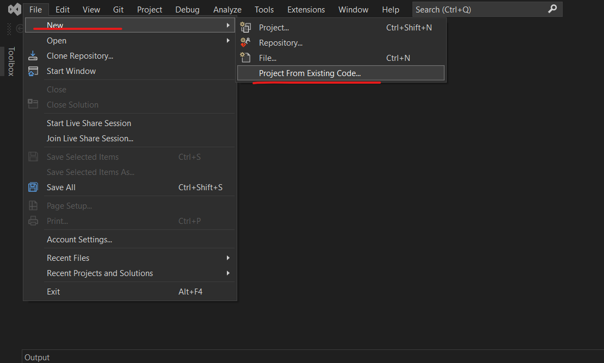
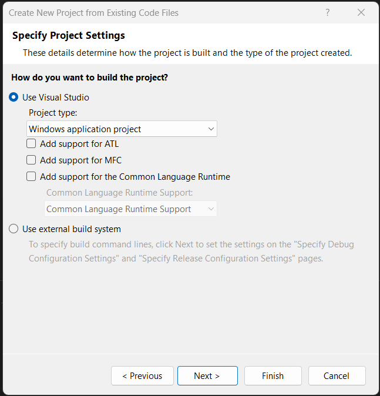
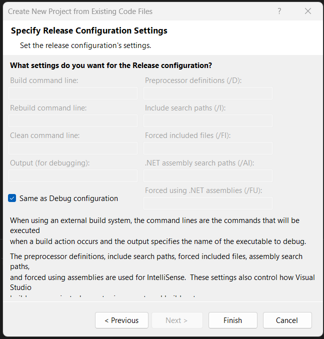
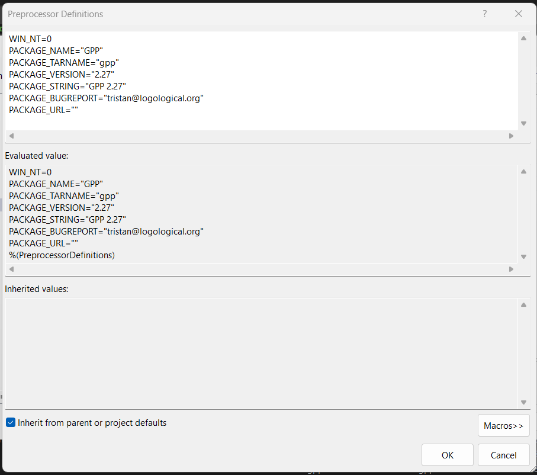

# Building GPP from source on Windows

A binary EXE file is provided within this folder, however if you want to build [GPP](https://github.com/logological/gpp) from source to generate a new/updated exe file follow these instructions.

1. Install Visual studio from here: https://visualstudio.microsoft.com/vs/community/
2. Download the GPP source, or the current release tarball from https://github.com/logological/gpp/releases/

3. Extract tarball to a location of your choosing.
4. Create a C++ Visual Studio project from an existing repository

   a. 
   b. 
   c. 
   d. 
5. Open up the project properties, select C/C++ -> Preprocessor, click the box besides "Preprocessor Defintions", and select `<Edit...>`. Then copy the code below into the first textbox:

```
WIN_NT=0
PACKAGE_NAME="GPP"
PACKAGE_TARNAME="gpp"
PACKAGE_VERSION="2.27"
PACKAGE_STRING="GPP 2.27"
PACKAGE_BUGREPORT="tristan@logological.org"
PACKAGE_URL=""
```




6. Finally build the release. The resulting _.exe_ file will be located in "./x64/Release/gpp.exe"


7. Add  the full path of "/x64/Release" to your environment PATH, or move the .exe file to a folder that is on your PATH.